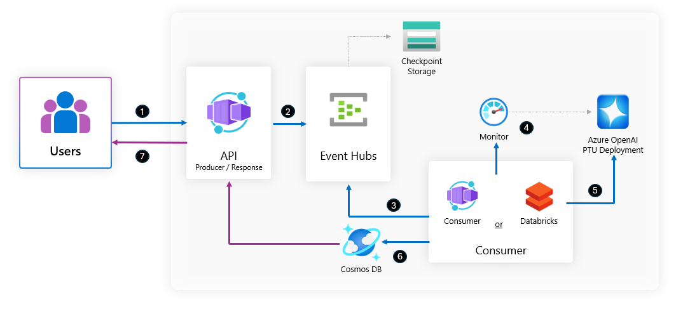

# 🚀 PTU Batch Usage Optimizer
An open-source solution for optimizing Azure OpenAI workloads in PTU [Provisioned Throughput](https://learn.microsoft.com/en-us/azure/ai-services/openai/concepts/provisioned-throughput?tabs=global-ptum) environments. This project intelligently queues and dispatches requests based on real-time PTU utilization, ensuring jobs are processed efficiently and cost-effectively when resources are available.

> **Note:** This project is open-source and intended as a starting point. You are encouraged to adapt and extend it to fit your specific requirements and production standards.

---

## 🏗️ Architecture Overview

The PTU Batch Usage Optimizer is designed with modular, cloud-native components for scalability and reliability:



1. The `producer` API route receives a request.
2. The request is enqued in Azure Event Hub.
3. The Consumer Service listens to Event Hub.
4. The Consumer checks PTU usage via Azure Monitor 
5. Then dispatches jobs to Azure OpenAI Service when utilization is below the threshold.
6. CosmosDB stores job states and results for tracking, auditing and store responses to be consumed later.
7. The `response` API route reads the processed results.

This architecture ensures jobs are processed efficiently, only when PTU resources are available, and all states are reliably tracked.
---

## ✨ Features

- **PTU Usage Optimization**: Automatically queue and sends Azure OpenAI processes when PTU [Provisioned Throughput](https://learn.microsoft.com/en-us/azure/ai-services/openai/concepts/provisioned-throughput?tabs=global-ptum) usage is below a defined threshold
- **FastAPI**: High-performance, easy-to-use Python web framework
- **Azure Event Hub Integration**: Seamlessly dispatches events for processing
- **CosmosDB Integration**: Reliable storage and tracking of events and job states using Azure CosmosDB
- **Structured Logging**: Consistent, production-grade logs
- **Docker Support**: Ready-to-use Dockerfiles and Compose for local and cloud deployments
- **Extensible Architecture**: Modular codebase for easy feature expansion
---

## 🏁 Quickstart

### 1. Clone the Repository
```bash
git clone <repo-url>
cd PTU-batch-usage-optimizer
```

### 2. Set Up Python Environment
```bash
python -m venv .venv
source .venv/bin/activate
```

### 3. Install Dependencies
```bash
pip install -r requirements.txt
```

### 4. Configure Environment Variables
Copy the example file and edit your secrets:
```bash
cp .env.example .env
# Edit .env with your Azure Event Hub, CosmosDB, and PTU settings
```

### 5. Run the API and Consumer
You can run the API and the consumer service directly?

**To run the API:**
```bash
python main.py
```

**To run the consumer service:**
```bash
python consumer_service.py
```

> **Tip:**
> For debugging, open the project in VS Code and use the pre-configured launch options in `.vscode/launch.json` to start and debug either the API or the consumer service interactively.

---

## 🧑‍💻 API Endpoints

### Health Check
- `GET /health`  
  _Returns API health status._

### Send a single Azure OpenAI Event
- `POST /producer`  
_Send an Azure OpenAI JSON payload. The event will be queued and processed when PTU usage is below the specified threshold._

**Request Example:**
```json
[{
    "messages":[{"role": "system", 
               "content": "You are an echo assistant. Respond exactly with the same text the user will enter"},
            {"role": "user", 
             "content": "TEST-01"},
             {"role": "assistant", "content": "TEST-01."},
             {"role": "user", "content": "TEST-02"}],
"temperature":1,
"top_p": 1,
"max_tokens":800
}
]
```

**Response Example:**
```json
{
    "request_ids": [
        "23b1942-...."
    ],
    "detail": "1 event(s) sent successfully"
}
```

### Send batch Azure OpenAI events
- `POST /producer`  
_Send a batch of Azure OpenAI JSON payloads. Each event in the array will be queued and processed when PTU usage is below the specified threshold._

**Request Example:**
```json
[
   {
      "messages": [
         {"role": "system", "content": "You are an echo assistant."},
         {"role": "user", "content": "TEST-01"}
      ],
      "temperature": 1,
      "top_p": 1,
      "max_tokens": 800
   },
   {
      "messages": [
         {"role": "system", "content": "You are an echo assistant."},
         {"role": "user", "content": "TEST-02"}
      ],
      "temperature": 0.7,
      "top_p": 0.9,
      "max_tokens": 500
   }
]
```

**Response Example:**
```json
{
   "request_ids": [
      "23b1942-....",
      "a8c1d2e-...."
   ],
   "detail": "2 event(s) sent successfully"
}
```
---
##  Databricks Integration

You can automate the **Consumer process** by creating a Databricks job that runs the consumer service notebook as part of your Workflows.

### Creating a Databricks Job for the Consumer

1. **Clone the Repository into Databricks**  
   Clone the PTU Batch Usage Optimizer repository into your Databricks workspace. 
   This ensures the consumer service notebook is available at `databricks/Consumer Service` for use in your Databricks jobs.

2. **Create a Databricks Job**  
   - In the Databricks UI, go to **Workflows > Jobs** and click **Create Job**.
   - Add a task to run a notebook:
     - **Type:** Notebook
     - **Path:** `Consumer Service notebook`

3. **Configure Secrets with Azure Key Vault**  
   - Add all required environment variables (such as CosmosDB, Event Hub, and PTU settings) to your Azure Key Vault.
   - Integrate Azure Key Vault with Databricks so these values are available as Databricks secrets.
   - In your notebook, access these secrets using Databricks utilities (e.g., `dbutils.secrets.get`).

4. **Schedule or Trigger the Job**  
   - Set a schedule for periodic execution, or
   - Trigger the job on demand or as part of a workflow.

#### References

- [Databricks Jobs Documentation](https://docs.databricks.com/en/jobs/index.html)
- [Databricks Secrets](https://docs.databricks.com/en/security/secrets/index.html)
- [Azure Key Vault Integration](https://learn.microsoft.com/en-us/azure/databricks/security/secrets/secret-scopes)

## ⚡ How It Works

- The API receives requests to process Azure OpenAI jobs.
- It checks the current PTU environment usage (via Azure Monitor).
- If the usage is below the configured threshold (for example, 70% PTU-M usage), the job is dispatched immediately.
- If not, the job is queued and dispatched when conditions are optimal.
- All events and job states are tracked in CosmosDB for reliability, auditing and be able to consume the processed responses.

---

## 🔐 CosmosDB Entra ID (RBAC) Permissions

This project uses [CosmosDB native RBAC](https://aka.ms/cosmos-native-rbac) for secure authentication. To grant permissions:

1. **Login to Azure:**
   ```bash
   az login
   ```
2. **Allow Key Authentication on CosmosDB:**
   ```bash
   resourceGroupName=<your-resource-group-name>
   accountName=<your-cosmosdb-account-name>

   az resource update --resource-type "Microsoft.DocumentDB/databaseAccounts" \
     --resource-group $resourceGroupName \
     --name $accountName \
     --set properties.disableLocalAuth=false
   ```
3. **Assign RBAC Role:**
   - Go to the [Azure Portal](https://portal.azure.com/)
   - Navigate to your CosmosDB account
   - Assign the appropriate role (e.g., `Cosmos DB Built-in Data Contributor`) to your user or service principal

---

## ⚙️ Environment Variables

| Variable                | Description                                 |
|-------------------------|---------------------------------------------|
| `EVENTHUB_CONNECTION_STR` | Azure Event Hub namespace connection string |
| `EVENTHUB_NAME`           | Name of the target Event Hub                |
| `COSMOSDB_URI`            | CosmosDB account URI                        |
| `COSMOSDB_DATABASE`       | CosmosDB database name                      |
| `COSMOSDB_CONTAINER`      | CosmosDB container name                     |
| `AZURE_CLIENT_ID`         | Azure Entra ID client ID                    |
| `AZURE_TENANT_ID`         | Azure Entra ID tenant ID                    |
| `AZURE_CLIENT_SECRET`     | Azure Entra ID client secret                |
| `PTU_MAX_UTILIZATION`     | Max allowed PTU utilization (e.g., 0.7)     |

---

## 🐳 Docker & Deployment

- **Build API Docker Image Locally:**
  ```bash
  ./util/build-docker-image.sh api
  ```
- **Build Consumer Docker Image Locally:**
  ```bash
  ./util/build-docker-image.sh consumer
  ```
- **Push API Docker Image to ACR:**
  ```bash
  ./util/push-docker-image.sh api
  ```
- **Push Consumer Docker Image to ACR:**
  ```bash
  ./util/push-docker-image.sh consumer
  ```
- **Run with Docker Compose:**
  ```bash
  docker-compose up --build
  ```

### 🚀 Build & Push to Azure Container Registry (ACR) using provided scripts

1. **Configure your variables:**
   - Edit `util/variables.sh` with your ACR name, image names, and tag.
2. **Login to Azure:**
   ```bash
   az login
   ```
3. **Build the Docker images:**
   ```bash
   ./util/build-docker-image.sh api
   ./util/build-docker-image.sh consumer
   ```
4. **Push the images to ACR:**
   ```bash
   ./util/push-docker-image.sh api
   ./util/push-docker-image.sh consumer
   ```

These scripts will automatically tag and push your images to the Azure Container Registry as configured in your `variables.sh` file.

---

## 📁 Project Structure

```
PTU-batch-usage-optimizer/
├── app/                # Core application code
│   ├── config.py       # Configuration management
│   ├── schemas.py      # Pydantic schemas
│   └── ...
├── src/                # EventHub, Cosmos, PTU monitoring, and processing logic
├── main.py             # FastAPI entrypoint
├── consumer_service.py # Consumer service
├── requirements.txt    # Python dependencies
├── Dockerfile*         # Docker configurations
├── util/               # Utility scripts
└── tests/              # Test suite
```

---

## 📚 Resources
- [FastAPI Documentation](https://fastapi.tiangolo.com/)
- [Azure Event Hub Docs](https://docs.microsoft.com/azure/event-hubs/)
- [CosmosDB RBAC](https://aka.ms/cosmos-native-rbac)
- [Azure OpenAI Service](https://learn.microsoft.com/azure/ai-services/openai/)
- [Provisioned Throughput Units (PTU)](https://learn.microsoft.com/azure/cosmos-db/provision-throughput)

---

## 📝 License

MIT License. See [LICENSE](LICENSE) for details.
